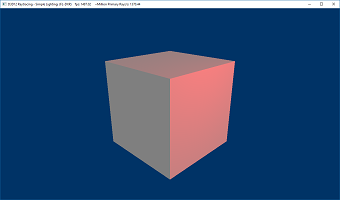

# D3D12 Raytracing Samples
This collection of samples act as an introduction to DirectX Raytracing (DXR). The samples are divided into tutorials and advanced samples. Each tutorial sample introduces a few new concepts. Advanced samples demonstrate more complex techniques and applications of raytracing. 

The samples implement both DXR and D3D12 Raytracing Fallback Layer APIs. This is purely for demonstration purposes to show where the API differences are. Real-world applications will implement only one or the other. The Fallback Layer uses DXR if a driver and OS supports it. Otherwise, it falls back to compute pipeline to emulate raytracing. Developers aiming for a wider HW support should target the Fallback Layer.

### Getting Started
* DXR spec/documentation is available in the SDK package at [Getting Started with Raytracing](http://forums.directxtech.com/index.php?topic=5860.0) post.
* [Raytracing Fallback Layer documentation](../../../LibrariesD3D12RaytracingFallback/readme.md).

# Tutorial Samples
## 1. [Hello World Sample](src/D3D12RaytracingHelloWorld/readme.md)
This sample demonstrates how to setup a raytracing pipeline and render a triangle in screen space.

## 2. [Simple Lighting Sample](src/D3D12RaytracingSimpleLighting/readme.md)
This sample demonstrates how to do ray generation for a dynamic perspective camera and calculate simple diffuse shading for a cube from a dynamic point light. 

# Advanced Samples

## [MiniEngine Sample](src/D3D12RaytracingMiniEngineSample/readme.md)
This sample demonstrates integration of the Fallback Layer in the MiniEngine's Model Viewer and several sample uses of raytracing.

## Requirements
* [Visual Studio 2017](https://www.visualstudio.com/) with the [Windows 10 Fall Creators Update SDK](https://developer.microsoft.com/en-US/windows/downloads/windows-10-sdk)
* Windows 10 with the Fall Creators Update
* A graphics card with retail DXIL capabilities.
* DXIL.dll should be pulled from the latest Windows SDK to accompany the compiler or enable Developer mode.
* Download DirectXRaytracingBinariesV1.0.zip from https://github.com/Microsoft/DirectX-Graphics-Samples/releases and copy all the contents to Samples/Desktop/D3D12Raytracing/tools/x64
* That is all that is required for the Fallback Layer. To take advantage of DXR you will additionally need a raytracing compatible driver. Please contact the IHV you’re working with for drivers that will work with DXR. For Nvidia, you can review the following blog post for the DXR support requirements: https://devblogs.nvidia.com/introduction-nvidia-rtx-directx-raytracing/.

## Feedback and Questions
We welcome all feedback, questions and discussions about DXR and the Fallback Layer at [DirectX Raytracing forums](http://forums.directxtech.com/index.php?PHPSESSID=394klvdd3683tt1fjkh2jteav1&board=248.0).
