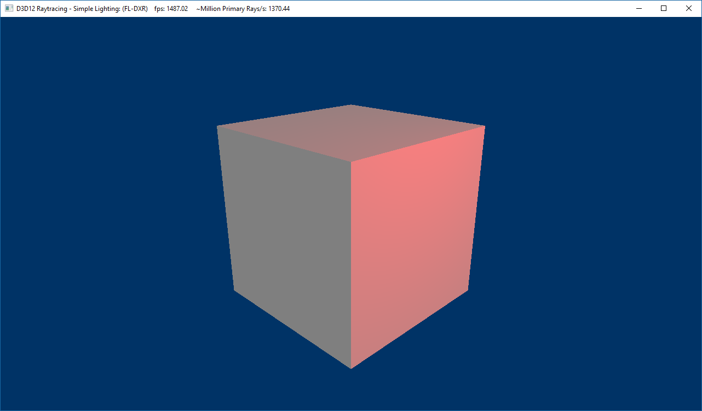

# D3D12 Raytracing Simple Lighting sample

This sample demonstrates how to do ray generation for a dynamic perspective camera and calculate simple diffuse shading for a cube from a dynamic point light. 

### Usage
The sample starts with Fallback Layer implementation being used by default. The Fallback Layer will use raytracing driver if available, otherwise it will default to the compute fallback. This default behavior can be overriden via UI controls or input arguments.

D3D12RaytracingSimpleLighting.exe [ -FL | -DXR ]
* [-FL] - select Fallback Layer API with forced compute fallback path.
* [-DXR] - select DirectX Raytracing API.

### UI
The title bar of the sample provides runtime information:
* Name of the sample
* Raytracing API being active:
  * FL - Fallback Layer with compute fallback being used
  * FL-DXR - Fallback Layer with raytracing driver being used
  * DXR - DirectX Raytracing being used
* Frames per second
* Million Primary Rays/s: a number of dispatched rays per second calculated based of FPS.

### Controls
* ALT+ENTER - toggles between windowed and fullscreen modes.
* 1 - select Fallback Layer API.
* 2 - select Fallback Layer API with forced compute fallback path.
* 3 - select DirectX Raytracing API.

## Requirements
* [Visual Studio 2017](https://www.visualstudio.com/) with the [Windows 10 Fall Creators Update SDK](https://developer.microsoft.com/en-US/windows/downloads/windows-10-sdk)
* Compatible OS and SDK:
  * Fallback Layer: Windows 10 with the Fall Creators Update.
  * DirectX Raytracing: Windows 10 with spring 2018 Update and private D3D12 headers & dlls for DirectX Raytracing (available from directxtech site).
* A graphics card with retail DXIL capabilities.
* DXIL.dll should be pulled from the latest Windows SDK to accompany the compiler or enable Developer mode.